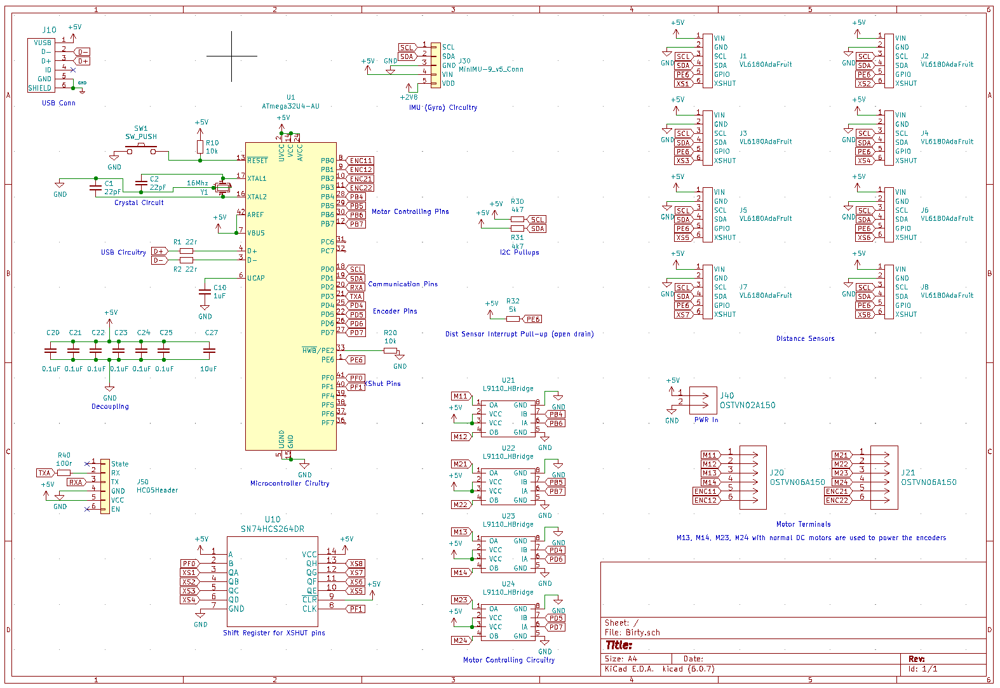
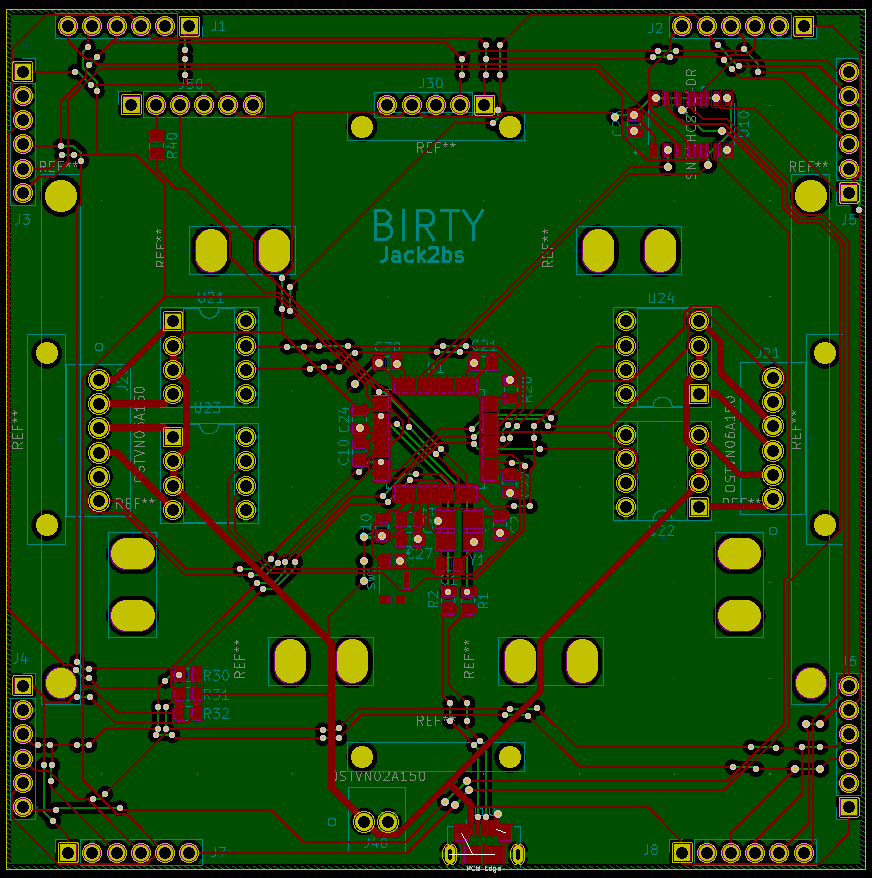
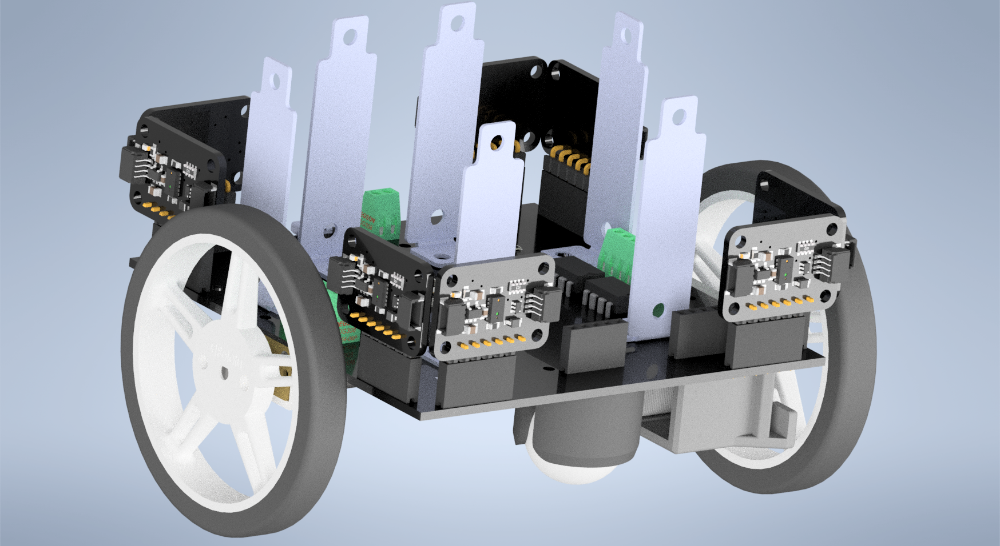
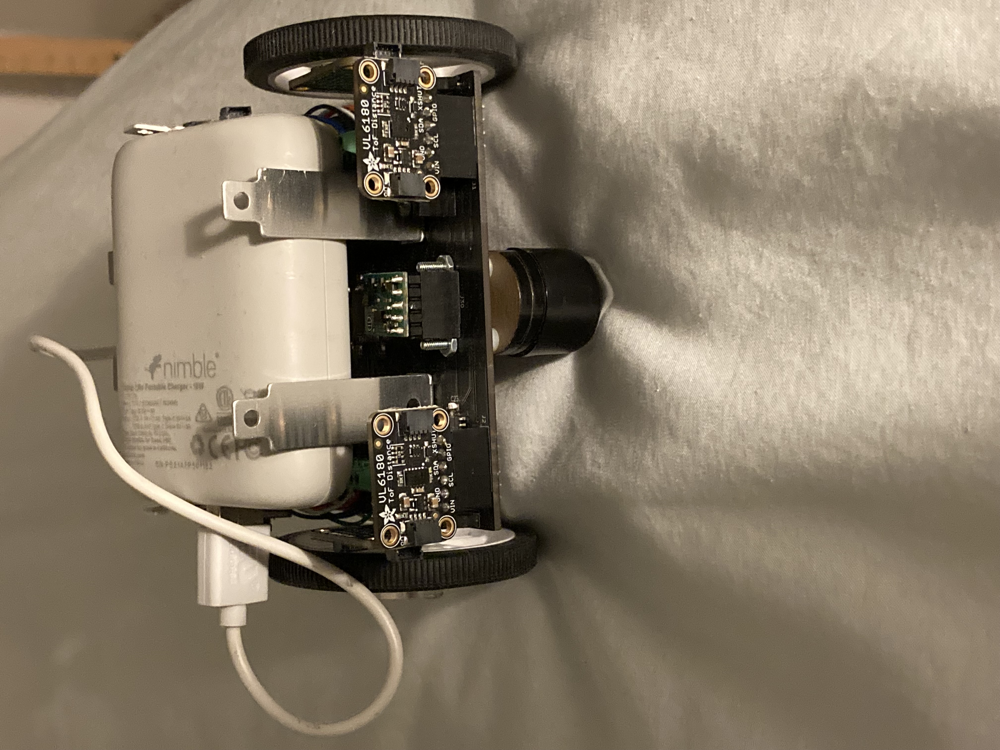
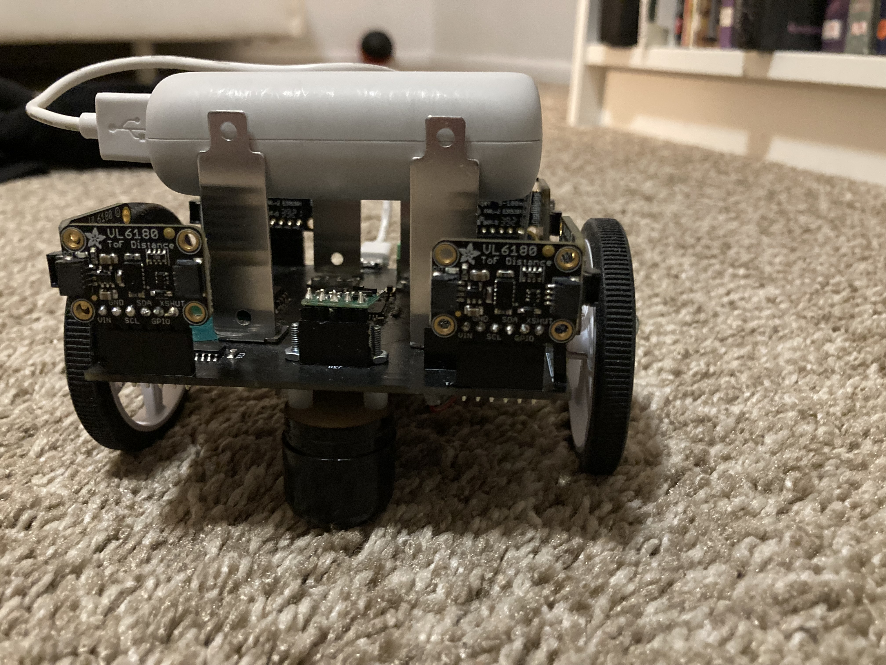

# Birty the Robot

Birty is a recursive backronym for Birty Is a Robot, Thank You.

As part of my getting acquainted with robotics so as to continue in a leadership capacity in the Princeton Robotics Club, I set out to build a classic and simple, but well designed and well programmed robot which could drive in straight lines, turn accurate angles, avoid obstacles in it's path, and do it all autonomously. While these goals may not sound particularly ambitious or impressive, they are the baseline and the scaffolding for what a robot needs to be able to do.

I am proud of Birty. Birty is my most polished large project to date. The part-selection was, with one exception, well thought out. The electronics are well designed. The 3d structure of the Robot was well planned. The code is well written; it's fast, self-documenting (and documented with comments), and highly functional.

My success building Birty came on the back of the shortcomings of past projects, some of which never lived up to their potential simply due to my mistakes and inexperience. I learned from my mistakes, and I improved. I organized the project better. I worked with each sensor and electrical component before I used them to make sure they functioned as I expected them to. I tested each bit of code before moving onto another function. I took the time to do things right, and in the end it was the fastest I've ever completed a project. 

# Parts and justifications

+ Microcontroller
	+ 1 x [ATMEGA32u4](https://www.digikey.com/en/products/detail/microchip-technology/ATMEGA32U4-AUR/2238241)
	+ The Atmega32u4 is more than powerful enough for the tasks laid out, and since I had experience with it and had some in my supplies (every MCU was out of stock at the time), this was a no-brainer. An I2C bus (using the TWI peripheral) for sensor communications, USART for debugging over bluetooth, GPIO for driving motors, pin change interrupts for reading encoders, and more than enough timers for task scheduling.
+ Distance Sensors
	+ 8 x [Adafruit VL6180x](https://www.adafruit.com/product/3316)
	+ The VL6180x from STM was a good choice because it has great accuracy at low distance ranges which is extremely important for obstacle detection and avoidance for a robot of Birty's size. I chose the 6180x over other sensors in the lineup since it is the only one with a register map available, allowing me to bypass STM's poorly regarded API and simply build an I2C communication layer myself. I chose the Adafruit breakouts so that I wouldn't have to make them myself, and so that I had logic level shifting from 5v to 3.3v on both the interrupt and xshut signal lines.
+ Gyroscope
	+ 1 x [MinImu-9 v5](https://www.pololu.com/product/2738)
	+ This was perhaps the one mistake I made in part selection. The MiniImu-9 v5 from Polulu is a good IMU, but it doesn't have onboard fusion calculation and the speed of the Atmega32u4 makes a complex fusion calculation a challenge. In the future I would lean more towards something like a BNO055 from Bosch, which has on board fusion calculations and outputs roll pitch and yaw, as opposed to x, y, and z for a gyroscope, accelerometer, and magnetometer seperately.
+ Motors
	+ 2 x [Regular DC motors](https://www.adafruit.com/product/4639)
	+ 2 x [Stepper Motors](https://www.adafruit.com/product/4411)
	+ I have both stepper and DC motors and I am able to interchange them as I see fit. The choices here weren't too important but I wanted them as small as I could find, and so that is what I got. 
+ Motor mounts
	+ 1 x [DC Motor Mount](https://www.pololu.com/product/989)
	+ 2 x [Stepper Mount](https://www.pololu.com/product/3435)
+ DC Motor Driver (H Bridge)
	+ 4 x [H Bridges](https://www.adafruit.com/product/4489)
	+ I tested these H bridges on a breadboard before using them on Birty and they proved to be simple and effective.
+ Wheels
	+ 1 x (2 wheels) [Wheel pair](https://www.pololu.com/product/1424)
	+ I wanted somewhat large wheels to attempt to improve Birty's ability to handle semi-rough terrain (carpet).
+ Universal Mounting Hubs
	+ 1 x (2 hubs) [Mounting hub pair](https://www.pololu.com/product/1997)
+ Ball Casters
	+ 2 x [Ball casters](https://www.pololu.com/product/955)
	+ These were so that Birty wouldn't tilt forwards or backwards.
+ Spacers
	+ 1 x [2mm spacers](https://www.pololu.com/product/1980)
	+ 1 x [4mm spacers](https://www.pololu.com/product/1981)
	+ To space the ball casters to the right height.
+ Battery
	+ 1 x [CHAMP Portable Charger](https://www.gonimble.com/products/champ-portable-charger)
	+ I chose this battery pack because it was the smallest I could find and because I am a sucker for sustainability.
+ Battery Mounting
	+ 3 x [Battery Mounts](https://www.pololu.com/product/2677)
	+ I'll explain the battery mounting strategy further when I get to mechanical design.
+ Wire to Board conns
	+ 2 x [6 Pos Wire to Board](https://www.digikey.com/en/products/detail/on-shore-technology-inc/OSTVN06A150/1588866) and 1 x [2 Pos Wire to Board](https://www.digikey.com/en/products/detail/on-shore-technology-inc/OSTVN02A150/1588862)
+ Shift registers
	+  1 x [Shift Register](https://www.digikey.com/en/products/detail/texas-instruments/SN74HCS264DR/13562988)
	+ I'll get into the purpose of the shift register when I discuss the electronics.
+ Assorted SMD Resistors and Capacitors
	+ 3 x 5k R
	+ 2 x 10k R
	+ 1 x 100 R
	+ 2 x 22 R
	+ 6 x 0.1uF C
	+ 1 x 1uF C
	+ 2 x 22pF C
	+ Pushbuttons
	+ 16Mhz Crystal
	+ USB Receptacle
+ Header Pins
	+ 9 x [6 Pos Female Header pins](https://www.digikey.com/en/products/detail/sullins-connector-solutions/PPPC061LFBN-RC/810178)
	+ 1 x [5 Pos Female Header Pins](https://www.digikey.com/en/products/detail/sullins-connector-solutions/PPPC051LFBN-RC/810177)

# Electrical design
After choosing parts I set out to design the schematic and circuit boards. This process was relatively straight forward, except I had to find a way to use as few GPIO pins as possible. The first measure I took was introducing a shift register to access the xshut pins on the 8 VL6180x sensors. I needed to be able to shutdown the sensors one at a time so that I could change their I2C addresses away from their default of 0x29, and so a shift register allowed me to start them all shutdown, and then restart them and set their addresses one at a time. Next, I realized that each of the interrupt pins on the VL6180x sensors could be set as open drain, and thus I could attach them all to one GPIO pin and poll them to see which one triggered an interrupt. These two tricks saved me 6 and 7 GPIO pins each, such that by the end I had 4 extra GPIO pins not being used. The final schematic looked like this:

I took this schematic and used it to produce a circuit board. I wanted every component on the top layer, which was not too difficult considering there was no real size constraint, and I wanted as large of a ground layer on the bottom layer of the board as possible, so I did the vast majority of my routing on the top layer as well. After a few hours of routing I had the following board.

# Mechanical Design
I knew that for a project that would exist in 3d space unlike any project I had done before, I would want to produce a 3d model of Birty so that I knew everything would fit together. It was during this process, I decided, that I would decide on how to mount the motors and battery pack to the robot. The motor mounts were as simple as adding mounting holes, but I knew the battery pack (which had no built in mounting method, seeing as it is just a portable phone charger) would be more difficult. After a significant amount of brainstorming, I decided upon a friction mount system based on stepper motor mounts which had a stiff hinge that allowed them to bend somewhere between -1 and 1 degree away from vertical. This allowed the battery pack to sit in between the mounts, as can be seen in the final picture of Birty at the very bottom of this README.

This was my first experience using Autocad Inventor, but I picked it up relatively quickly and the final product was the following 3d render.

# Programming
As could be expected for a project like this, writing the firmware took the most time. I started with a USART driver since I could use that for debugging, and then moved to an I2C driver so I could communicate with the sensors. Both the USART driver and I2C driver became bases for libraries I have since written. Next I moved onto code for receiving data from each of the sensors and then for communicating with the motors. Next I added some basic PID code for making sure the robot drove straight, and via testing determined that the Integral and Derivative components were not needed in Birty's case (the proportional control was enough). Finally I made sure that Birty could detect and avoid obstacles, or if near by a wall could drive straight and parallel to the wall.

# What went wrong and how did I fix it
Despite the relative success of building Birty, there were some hiccups-two short circuit incidents. The first short circuit occurred due to a lack of insulation between one of the motors and some of the H bridge's through hole pins. This ended up heating up the PCB to the point of destroying a small section of one of the encoder traces. I was fortunate that around a tenth of a millimeter of trace was exposed on either side, and so with a small piece of copper wire and some creative soldering I was able to bridge the damaged trace and cover it with electrical tape such that it has had no issues since. 

The second short circuit occurred when I plugged in the IMU wrong. Fortunately, only the IMU was damaged, and since I had ordered a spare, I was able to slot it in and continue as if nothing had happened. In addition, the IMU ended up being my least used sensor since I didn't want to give up clock cycles to a complicated fusion algorithm throughout my testing of Birty.

# Finally
Here are some pictures of Birty in my dorm room this year. Building Birty proved to me that when engineering is done right, it can be smooth and highly effective, which only reinforced just how beautiful this stuff can really be!

